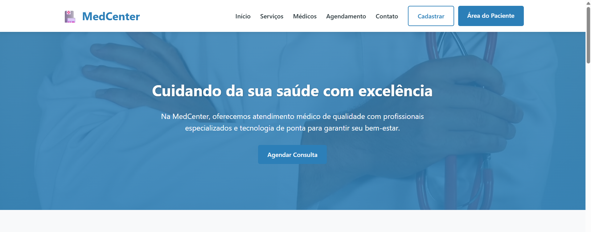

# MedCenter - Plataforma de Agendamento Médico

## 🖥️ Preview do Sistema

<div align="center">
  
  <br>
  <sup>Interface principal da plataforma JobConnect</sup>
</div>

## 📋 Sobre o Projeto

O **MedCenter** é uma plataforma web moderna e responsiva desenvolvida para clínicas e consultórios médicos, facilitando o agendamento de consultas online e apresentação dos serviços de saúde oferecidos.

## 🎯 Objetivo

A plataforma tem como objetivo principal:
- **Para pacientes**: Oferecer uma forma simples e intuitiva de agendar consultas médicas
- **Para a clínica**: Apresentar seus serviços, equipe médica e informações de contato de maneira profissional
- **Digitalizar processos**: Reduzir a necessidade de agendamentos telefônicos e melhorar a experiência do paciente

## 🏥 Funcionalidades Principais

### 1. **Apresentação Institucional**
- Página inicial com hero section atrativa
- Apresentação completa dos serviços médicos oferecidos
- Galeria de profissionais com informações detalhadas

### 2. **Sistema de Agendamento**
- Formulário intuitivo para solicitação de consultas
- Seleção de especialidades médicas
- Escolha de data e horário preferenciais
- Validação em tempo real dos dados

### 3. **Design Responsivo**
- Layout adaptável para todos os dispositivos (desktop, tablet, mobile)
- Navegação otimizada para mobile com menu hamburguer
- Interface acessível e user-friendly

### 4. **Informações de Contato**
- Múltiplos canais de comunicação
- Formulário de contato integrado
- Horários de funcionamento e localização

## 🛠️ Como Funciona

### Para o Usuário Final:
1. **Navegação**: Acessa o site e explora os serviços disponíveis
2. **Escolha do Serviço**: Seleciona a especialidade médica desejada
3. **Agendamento**: Preenche o formulário com:
   - Dados pessoais (nome, telefone, e-mail)
   - Especialidade médica
   - Data e horário preferenciais
4. **Confirmação**: Recebe confirmação visual do envio
5. **Contato**: Aguarda o retorno da clínica para confirmação final

### Para a Administração:
1. **Recebimento**: As solicitações de agendamento são recebidas
2. **Validação**: Confirma disponibilidade médica
3. **Confirmação**: Entra em contato com o paciente para confirmar
4. **Gestão**: Mantém controle sobre agendamentos e disponibilidades

## 📱 Tecnologias Utilizadas

- **HTML5**: Estrutura semântica e acessível
- **CSS3**: 
  - Variáveis CSS para consistência visual
  - Grid e Flexbox para layouts responsivos
  - Animações e transições suaves
  - Design System com cores padronizadas
- **JavaScript**: 
  - Validação de formulários
  - Navegação suave
  - Animações on scroll
  - Menu mobile interativo

## 🎨 Características do Design

### Sistema de Cores:
- **Primary**: Azul profissional (#2c7fb8)
- **Secondary**: Verde saúde (#7fcdbb)
- **Accent**: Amarelo suave (#edf8b1)
- **Dark**: Textos principais (#253237)

### Experiência do Usuário:
- Loading states durante envios
- Mensagens de sucesso/erro
- Feedback visual imediato
- Navegação intuitiva

## 📞 Seções da Plataforma

1. **Header**: Navegação principal e acesso rápido
2. **Hero**: Apresentação inicial e call-to-action
3. **Serviços**: Catálogo de especialidades médicas
4. **Médicos**: Apresentação da equipe profissional
5. **Agendamento**: Formulário principal de marcação
6. **Contato**: Informações e formulário de contato
7. **Footer**: Links importantes e informações legais

## 🔄 Fluxo de Trabalho

```
Usuário → Acessa Site → Navega → Seleciona Serviço → 
Preenche Formulário → Envia Solicitação → 
Clínica Recebe → Confirma → Retorna ao Usuário
```

## 🌟 Benefícios

### Para Pacientes:
- Agendamento 24/7
- Redução do tempo de espera
- Informações centralizadas
- Experiência digital moderna

### Para a Clínica:
- Redução de custos operacionais
- Organização de agendamentos
- Apresentação profissional
- Melhoria na comunicação

## 📊 Responsividade

A plataforma é totalmente responsiva, adaptando-se a:
- **Desktop**: Layout completo com todas as funcionalidades
- **Tablet**: Layout otimizado para telas médias
- **Mobile**: Experiência mobile-first com navegação simplificada

## 🔒 Considerações de Segurança

- Validação de dados no front-end
- Formatação adequada de informações
- Proteção contra envios duplicados
- Feedback claro sobre o status das ações

---

*MedCenter - Transformando a experiência em saúde através da tecnologia*
